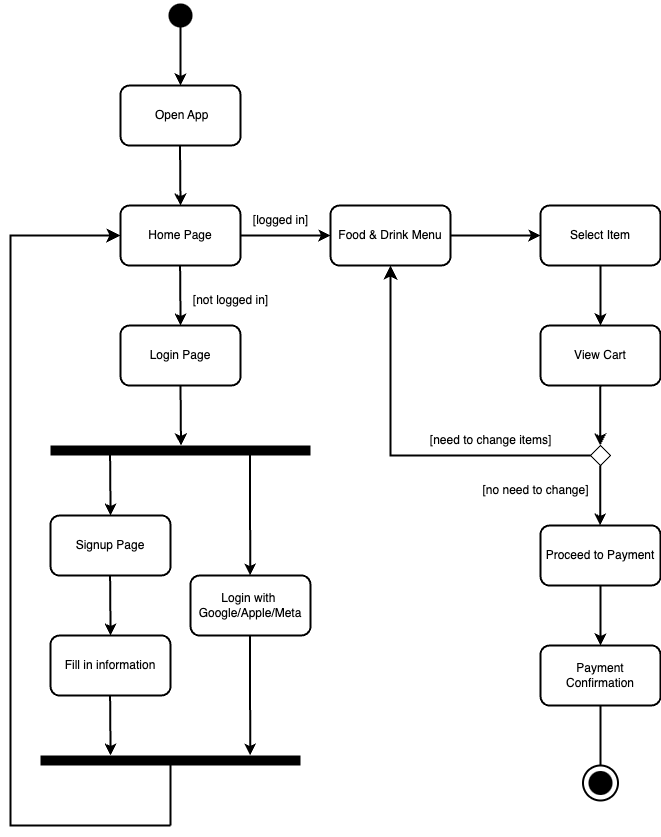

# Specification Phase Exercise

A little exercise to get started with the specification phase of the software development lifecycle. See the [instructions](instructions.md) for more detail.

## Team members
- Jiangbo Shen: https://github.com/js-montgomery 
- Ethan Yu: https://github.com/ethanyuu910

## Stakeholders
We plan to design a mobile app for a movie theater that allows users to explore the latest movie trends and purchase movie tickets online. To ensure the app meets stakeholders' needs, we interviewed 8 students majoring in communication and/or marketing. We believe they are good representatives of the type of people for whom we are designing the app.

Based on the inverviews, we have identified some core problems that can be fixed with the mobile app:
1. **In-person queue times:** long wait times for purchasing ticket can lead to poor customer expriences. Our app will enable customers to skip the waiting by supporting in-app ticket selling and using digital tickets for entry, which significantly reduce wait times.
2. **Limited customer data and insights:** collecting customer data, such as age and gender, is difficult with traditional ticket sales. This lack of detaiiled information limits personalized marketing and service improvements. The app will streamline data collection, providing deeper insights into user preferences and market trends.
3. **In-theater experience:** improving the in-theater experience is a major challenge for movie theaters. The app will serve as a solution by offering features like pre-ordering snacks with in-seat delivery.
4. **Competition from third-part apps:** third-party apps that selling movie tickets often redirect customers to competitors. This not only results in a lost of direct revenue, but also weakens the relationship with customers. Our app will help retain customers by offering a seamless, all-in-one experience. 

The interviews also suggest the potential goals or needs from stakeholders:
1. **Increase ticket sales:** 87.5% of stakeholders identified increasing ticket sales as the primary goal for the app. A mobile app can attract more customers by offering convenient ticket purchasing, exclusive promotions, and real-time updates on movie availability.
2. **Enhance customer loyalty and engagement:** building long-term relationships with customers is a priority. The app can foster loyalty through features like personalized recommendations, rewards programs, and special offers for frequent moviegoers.
3. **Target customer segmentation:** teenagers and young adults are key demographics for movie theaters. The app can cater to this audience by integrating social features, trending content, and interactive elements that resonate with their preferences.
4. **Improve operational efficienty:** stakeholders seek to streamline operations and reduce costs. The app can automate processes like ticket sales, data collection, and customer feedback, allowing theaters to focus on delivering a better overall experience.

By addressing these challenges and aligning with stakeholder goals, the mobile app will not only enhance the movie-going experience but also drive business growth and customer satisfaction for theaters.

## Product Vision Statement
The mobile app is designed to streamline the movie-going experience by allowing users to discover the latest trends, book tickets, pre-order snacks, and access personalized offers while helping theaters improve customer engagement, operational efficiency, and revenue growth.

## User Requirements
> As a **moviegoer**, I want **to browse the latest movie trends and showtimes** so that **I can stay updated and plan my visit to the theater.**  
> Estimation of effort: S  
> Acceptance criteria:
> 1. Trending movies are highlighted with posters and trailers.
> 2. Users can filter movies by genre, rating, or time.

> As a **busy parent**, I want **to purchase tickets online** so that **I can avoid long queues and save time at the theater.**  
> Estimation of effort: M  
> Acceptance criteria:
> 1. Users can select seats from a theater layout.
> 2. A digital ticket is generated for entry.

> As a **frequent moviegoer**, I want **to earn rewards points for every ticket I buy** so that **I can redeem them for free tickets or snacks.**  
> Estimation of effort: M  
> Acceptance criteria:
> 1. Points are automatically added to the user’s account after purchase.
> 2. Users can view their points balance in the app.
> 3. Points can be redeemed for rewards like free tickets or snacks.

> As a **teenager**, I want **to see trailers and trending movie content on the app** so that **I can decide what to watch with my friends.**  
> Estimation of effort: S  
> Acceptance criteria:
> 1. Trailers are easily accessible and playable within the app.
> 2. Trending content is updated regularly.
> 3. Users can share trailers with friends via social media.

> As a **customer**, I want **to pre-order snacks and drinks for in-seat delivery** so that **I can enjoy a seamless movie experience without leaving my seat.**  
> Estimation of effort: L  
> Acceptance criteria:
> 1. Users can browse a menu of available snacks and drinks.
> 2. Orders are delivered to the correct seat number.

> As a **user**, I want **to receive personalized movie recommendations based on my preferences** so that **I can discover new films I might enjoy.**  
> Estimation of effort: S  
> Acceptance criteria:
> 1. Recommendations are based on past viewing history and preferences.
> 2. Users can rate movies to improve recommendations.
> 3. Recommendations are displayed prominently on the home screen.

> As a **movie enthusiast**, I want **to read reviews and ratings from other users** so that **I can make informed decisions about which movies to watch.**  
> Estimation of effort: S  
> Acceptance criteria:
> 1. Reviews and ratings are displayed for each movie.
> 2. Users can sort reviews by most recent or highest rating.
> 3. Users can submit their own reviews after watching a movie.

> As a **theater manager**, I want **to collect customer data like age and gender through the app** so that **I can tailor marketing campaigns and improve services.**  
> Estimation of effort: M  
> Acceptance criteria:
> 1. Data is collected during registration or ticket purchase.
> 2. Reports can be generated for marketing analysis.

> As a **elder customer**, I want **a clear app layout with easy-to-read fonts** so that **I can quickly and easily purchase tickets without additional help.**  
> Estimation of effort: S  
> Acceptance criteria:
> 1. Showtimes are displayed in a clear, easy-to-read format.
> 2. User can manually change the font size or color theme.

> As a **user**, I want **to receive notifications about exclusive promotions and discounts** so that **I can save money on tickets.**  
> Estimation of effort: S  
> Acceptance criteria:
> 1. Users can opt in or out of notifications.
> 2. Notifications are timely and relevant to the user’s preferences.

## Activity Diagrams

#### User Story 1: 
As a customer**, I want to pre-order snacks and drinks for in-seat delivery so that I can enjoy a seamless movie experience without leaving my seat.
#### Activity Diagram 1:

#### User Story 2:
As a frequent moviegoer, I want to earn rewards points for every ticket I buy so that I can redeem them for free tickets or snacks.
#### Activity Diagram 2:

#### Wireframe Diagram:

## Clickable Prototype
[Link to prototype](https://www.figma.com/proto/Q5FBLWclInzfxCTdUdQC4W/MovieTicketBookingApp?node-id=4-8&p=f&t=PWTH6TBslF60YlNj-1&scaling=scale-down&content-scaling=fixed&page-id=0%3A1&starting-point-node-id=44%3A527)